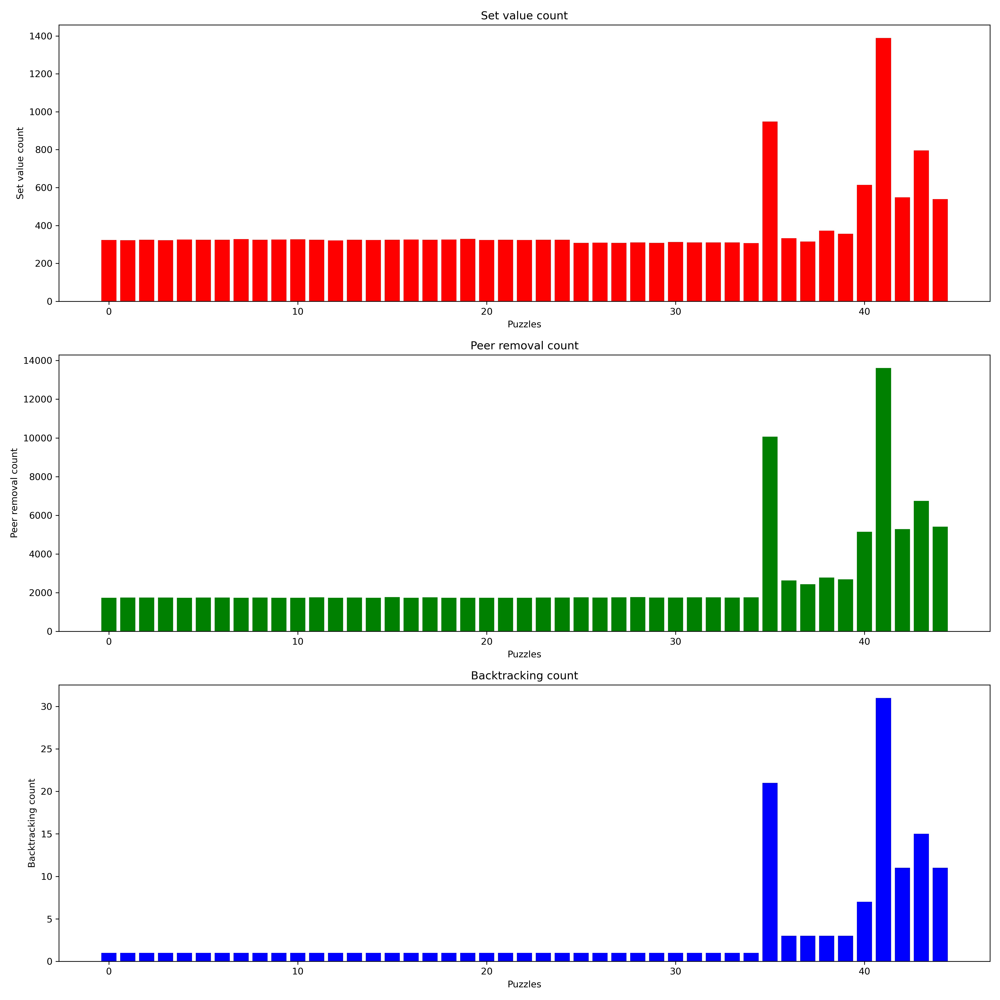

## Sudoku Solver.

An implementation to solve Sudoku puzzles of varying difficulty.

Sudoku is a discrete constraint satisfaction problem [1] where:
```
X = {A1, A2, A3, A4, A5, A6, A7, A8, A9
	.........
	.........
	.........
    I1, I2, I3, I4, I5, I6, I7, I8, I9}

D = {1,2,3,4,5,6,7,8,9}

C = {no digit can appear twice in a row, column or box of 3x3}

```

### Design Approach

The set of variables X represents the different cells of 9x9 sudoku grid. Each cell is assigned an id at the start of the puzzle and a dictionary is used to store the possible values of each cell.
The domain D represents the possible values each cell can take. Each cell is assigned a string of the possible value digits at the start of the puzzle. Initially a list of possible values was chosen but since deep copying needed to be done in recursive calls, string of possible values was chosen for efficiency. The consistent and complete solution is when all variables have a single possible value.

We start by creating 3 groups of variables called units to realize the constraints in code.
- Row units: All the cells in a row are grouped in to a row unit. So, 9 row units in total.
- Column units: All the cells in a column are grouped in to a column unit. So, 9 column units in total.
- Box units: Groups of 3x3 cells starting from cell A1 are grouped in to box units.
The combination of above 3 units are called peers and help to identify constraints for any cell. A peer for a cell are the combination of row unit, column unit and box unit to 
which it belongs.  A dictionary is used to store the peer cells for each cell id.

At first the pre-assigned values are assigned to each of the cell sequentially. 
Assignment to a cell consists of
- Removing other possible values of the from the peer cells
- Setting single value to the cell if it has only single possible value left.
- Setting single value to the cell if it has only single possible value left, for all other cell in the unit to which the cell belongs to (singleton).

This approach ensures partial consistent assignment through constraint satisfaction [2]. All the very-easy, easy and medium sudoku puzzles can be solved through this approach.
For hard sudoku puzzles backtracking was needed. This is accomplished through depth first search by:
- Find the cell with least number of possible values.
- Sequentially attempt partial consistent assignment of that value.
- If there is no solution from previous step then retry with the other possible values available and continue the process till a solution is available.

In order to isolate values between different tracks of search a copy of the possible value dictionary is used each time [4].


## Statistics

Constraint satisfaction is split in to setting of value and removing of peers.

  
<br>
Debugging traces are enabled through debug flags.

|Flag|Type of traces|Default setting|
|----|-----|-----|
|err_debug|Error messages from each function| False|
|debug| Addtional progress messages from each function| False|

<br>

### References:

[1] Moodle page: https://moodle.bath.ac.uk/mod/page/view.php?id=974674 <br>
[2] Moodle page: https://moodle.bath.ac.uk/mod/page/view.php?id=974673 <br>
[3] Moodle page: https://moodle.bath.ac.uk/mod/page/view.php?id=974677 <br>
[4] Solving Every Sudoku Puzzle: https://norvig.com/sudoku.html <br>
[5] Matplotlib Bars: https://www.w3schools.com/python/matplotlib_bars.asp <br>
